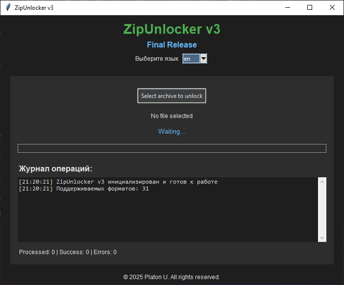

# ZipUnlocker



> **Внимание**: Это pre-release, могут быть ошибки и баги.

ZipUnlocker - это простая программа подбора паролей для архивов.

## Качества

- Drag & drop интерфейс
- Поддержка нескольких форматов
- Визуальное отслеживание прогресса
- Быстрый подбор пароля
- Автоматическая распаковка после подбора

## Поддерживаемые форматы:

| Формат   | Поддержка |
|----------|------------------|
| ZIP      | ✅               |
| RAR      | ✅               |
| 7Z       | ✅               |

## Установка

1. Клон репозитория:
```bash
git clone https://github.com/windusik/ZipUnlocker.git
cd ZipUnlocker
```
2. Установите требования
```bash
pip install -r requirements.txt
```
3. Запустите start.bat (или main.py для linux)
